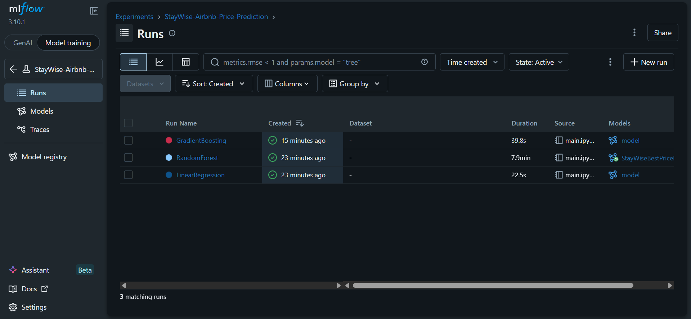
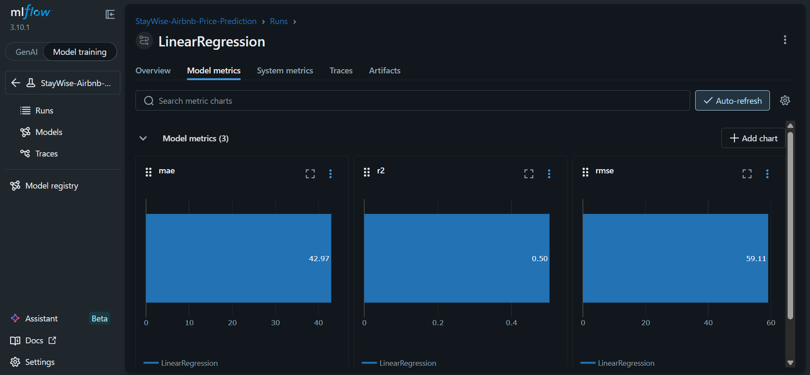
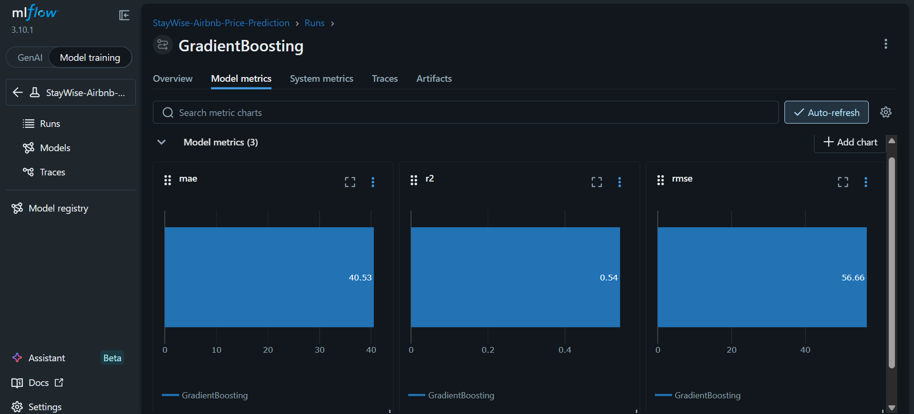
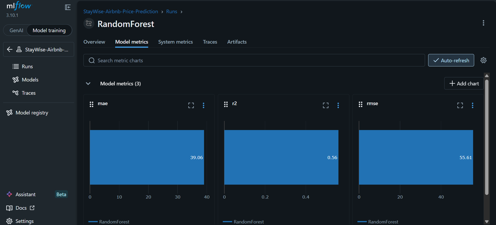
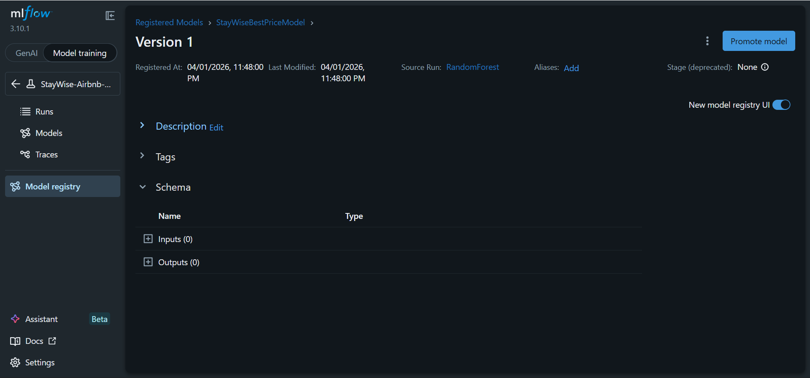

# StayWise Airbnb Listing Price Prediction

## Project Overview

This project was developed for the Data Science team at **StayWise**, a global vacation rental platform. The goal is to build a machine learning pipeline that predicts the **optimal nightly price** for Airbnb-style listings using property details such as location, room type, availability, and review history.

The dataset is stored in **AWS S3**, and the complete machine learning workflow uses **MLflow** for experiment tracking and model management.

## Objectives

The project covers the following tasks:

- Retrieve Airbnb listings data from **AWS S3**
- Perform **data cleaning and preprocessing**
- Handle **missing values**, **outliers**, and **categorical features**
- Train and compare multiple **regression models**
- Track experiments using **MLflow**
- Register the best-performing model in the **MLflow Model Registry**
- Present the workflow in a clean and reproducible GitHub repository

## Project Structure

```text
staywise-airbnb-pricing/
├── main.ipynb
├── requirements.txt
├── .gitignore
├── README.md
├── screenshots
```

## Workflow

The project follows this workflow:

1. **Data Loading**
   - Connect to AWS S3 using `boto3`
   - Read the dataset from the S3 bucket into a pandas DataFrame

2. **Data Preprocessing**
   - Inspect missing values
   - Convert date fields
   - Engineer time-based features
   - Remove or cap outliers using IQR
   - Encode categorical variables
   - Scale numerical variables

3. **Model Development**
   - Train multiple regression models:
     - Linear Regression
     - Random Forest Regressor
     - Gradient Boosting Regressor
   - Evaluate models using:
     - RMSE
     - MAE
     - R² Score

4. **Experiment Tracking with MLflow**
   - Log parameters, metrics, and artifacts
   - Compare runs in the MLflow UI
   - Register the best model in the MLflow Model Registry

## Dataset Access from AWS S3

The raw dataset is stored in AWS S3.

Example path:

```text
s3://your-bucket-name/airbnb/raw_data/listings.csv
```

The notebook uses `boto3` to access the file and load it into pandas.

## Setup Instructions

### 1. Clone the repository

```bash
git clone https://github.com/ajay9803/Assessment-2.git
cd Assessment-2
```

### 2. Create a virtual environment

```bash
python -m venv .venv
```

### 3. Activate the virtual environment

#### On Windows

```bash
.venv\Scripts\activate
```

#### On macOS/Linux

```bash
source .venv/bin/activate
```

### 4. Install dependencies

```bash
pip install -r requirements.txt
```

### 5. Launch Jupyter Notebook

```bash
jupyter notebook
```

Then open:

```text
main.ipynb
```

## Running the Project

Follow the notebook cells in this order:

1. Install required libraries
2. Connect to AWS S3 and load the dataset
3. Perform preprocessing and feature engineering
4. Split data into train and test sets
5. Train multiple models
6. Log runs with MLflow
7. Register the best model
8. Save results and screenshots

## MLflow Tracking

MLflow is used to track:

- Model names
- Hyperparameters
- Evaluation metrics
- Trained model artifacts
- Best model registration

To launch MLflow UI locally, run:

```bash
mlflow ui --port 5000
```

Then open:

```text
http://127.0.0.1:5000
```

## MLflow Screenshots

Add screenshots inside the `screenshots/` folder and reference them here:

### Experiment Runs


### Metrics Comparison




### Model Registry


## Models Used

The following regression models were trained and compared:

- Linear Regression
- Random Forest Regressor
- Gradient Boosting Regressor

## Evaluation Metrics

The project uses the following regression metrics:

- **RMSE (Root Mean Squared Error)**
- **MAE (Mean Absolute Error)**
- **R² Score**

These metrics help compare model accuracy and generalization performance.

## Key Insights and Observations

- The `price` column required cleaning and outlier treatment before modeling.
- Missing values in `reviews_per_month` and `last_review` needed preprocessing.
- Date-based feature extraction improved feature representation.
- Categorical fields such as `neighbourhood_group`, `neighbourhood`, and `room_type` were important predictors.
- Tree-based models performed better than simple linear models on this dataset.
- MLflow made it easier to compare experiments and identify the best model version.

## Future Improvements

Possible next steps for improving this project include:

- Hyperparameter tuning with GridSearchCV or Optuna
- More advanced feature engineering
- Location clustering using latitude and longitude
- Deploying the registered model as an API
- Automating the pipeline with a workflow tool such as Airflow